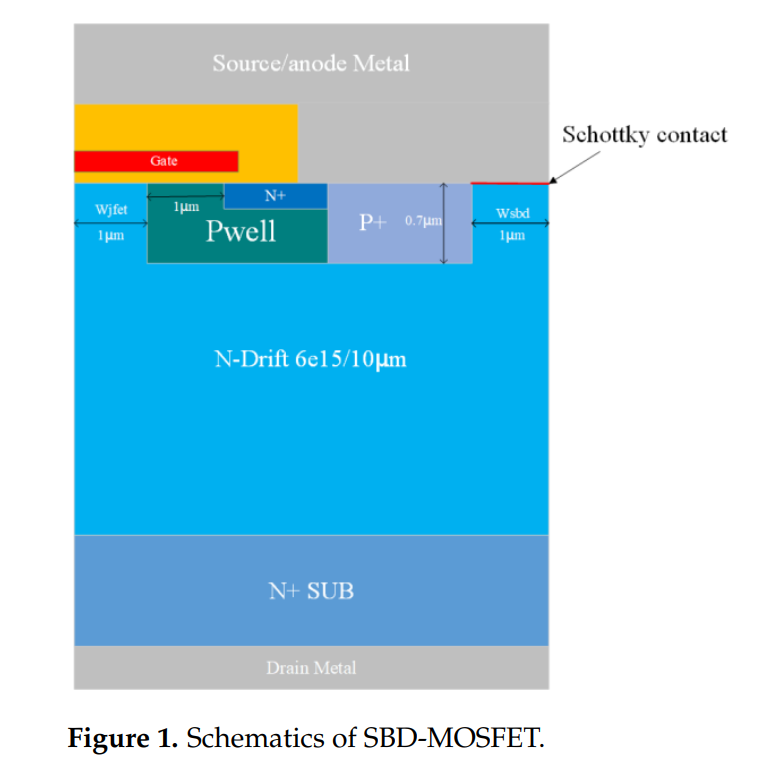
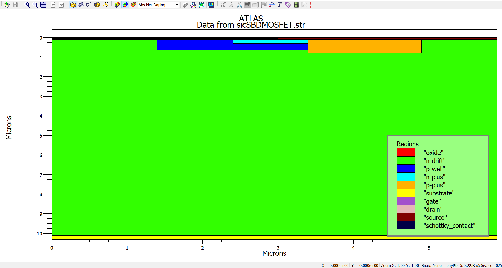
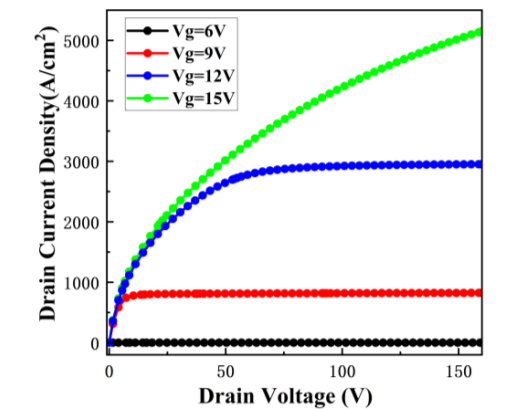
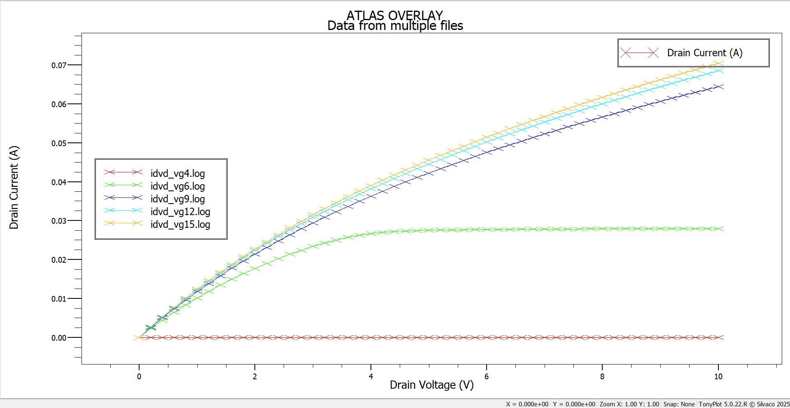
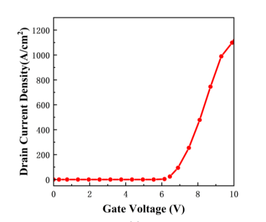
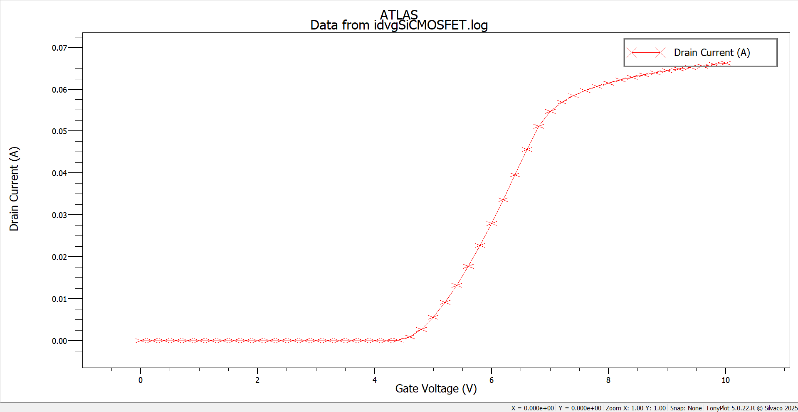
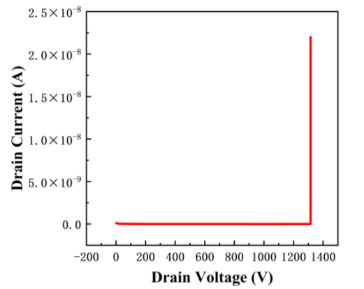
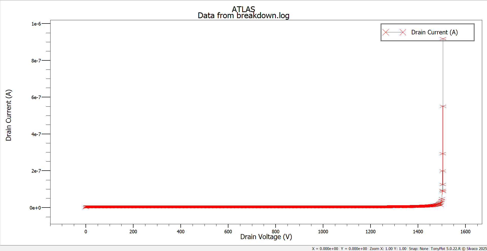

# SiC MOSFET-SBD Device Simulation and ML-Based Performance Prediction

## 📌 Project Overview

This repository is my attempt to **implement the research paper**:

> **"SiC MOSFET with Integrated SBD Device Performance Prediction Method Based on Neural Network"**

The project demonstrates:
- **Device Simulation** of a SiC MOSFET integrated with a Schottky Barrier Diode (SBD) using Silvaco ATLAS.
- **Graphical Analysis** of device characteristics (Output, Input, Breakdown).
- **Generalized Simulation Automation** for 625 parameter variations (P-well doping, P-well depth, JFET width, SBD width).
- **Neural Network Model** to predict device performance parameters (Specific On-Resistance \(R_{on,sp}\), Threshold Voltage \(V_{th}\), Breakdown Voltage (BV)) from structural parameters.

⚠️ Due to **hardware limitations**, I could not execute all 625 simulations and train the ML model on the full dataset. However:
- The **entire pipeline is implemented**.
- The **machine learning architecture is fully written and functional**, ready to train on a dummy dataset or real data if generated.
- Anyone can **reuse this repository to run the full pipeline** on a high-performance machine.

---

## 📖 Journey

I began this project **at the end of July**, with **zero prior knowledge of Silvaco ATLAS**.  
Here's how the implementation progressed:

1. **Learning Silvaco from Scratch:**  
   - With no proper tutorials or guides available online, I relied solely on the **1200-page Silvaco manual**.  
   - Progress was slow and debugging was extremely challenging due to limited online support.

2. **Single Device Simulation:**  
   - Implemented the given SiC MOSFET with integrated SBD structure as described in the paper.
   - Extracted **I-V characteristics** and threshold voltage \(V_{th}\).  
   - The paper reported \(V_{th} = 6.101V\), whereas my simulation resulted in **5.0889V** because:
     - Some device parameters were not specified in the paper.
     - Computational limitations forced me to use **less coarse meshing**, affecting accuracy.

3. **Graph Generation:**  
   - Reproduced **Output Characteristics**, **Input Characteristics**, and **Breakdown Characteristics** as shown in the paper.
   - Scripts were written to automatically plot results from Silvaco simulation outputs.

4. **Generalized Simulation:**  
   - Developed a **parameter sweep automation program** to simulate 625 devices with varying:
     - P-well doping  
     - P-well depth  
     - JFET width  
     - SBD width  
   - The code is fully functional but could not be fully executed due to resource constraints (one simulation takes ~40 min on my machine).

5. **Machine Learning Model:**  
   - Implemented the **neural network architecture** exactly as proposed in the paper, with an enhanced feature extraction pipeline.
   - The model is fully written and can be trained on:
     - A **dummy dataset** (provided for testing the pipeline).
     - The **real dataset** once the 625 simulations are completed.

---

## 🚧 Challenges with Silvaco

Working with Silvaco ATLAS was one of the most challenging aspects of this project:

- **❌ Lack of Learning Resources:**  
  No proper tutorials or guides are available online for complex device simulations.  
  Most learning had to come from the **1200+ page manual**, making the process time-consuming.

- **⚠️ Debugging Issues:**  
  Errors are often cryptic and require multiple trial-and-error attempts to resolve.

- **⏳ Extremely Slow Simulations:**  
  Each device structure takes **30–40 minutes to simulate**, making large-scale parameter sweeps difficult on a personal machine.

---

## 📊 Results (Single Device)

The following section compares the **results from the paper** with **my simulation results** for a single MOSFET.

### 1️⃣ Threshold Voltage \(V_{th}\)
- **Paper:** 6.101 V  
- **My Simulation:** 5.0889 V

⚠️ **Reason for Deviation:**  
- Missing some parameter definitions in the paper.  
- Computational limits forced me to use a **less fine mesh**, impacting accuracy.

---

### 2️⃣ Graphical Comparisons

| **Characteristic**       | **Graph from Paper** | **My Implementation** |
|--------------------------|----------------------|-----------------------|
| **Device Structure**      |  |  |
| **Output Characteristic** |  |  |
| **Input Characteristic**  |  |  |
| **Breakdown Voltage**     |  |  |

---

## 🧠 Machine Learning Architecture – SiC-SBD MOSFET Performance Prediction

This module implements the **neural network architecture** inspired by the research paper:

> **"SiC MOSFET with Integrated SBD Device Performance Prediction Method Based on Neural Network"**

The model predicts:
- Specific ON-Resistance (\( R_{on,sp} \))
- Threshold Voltage (\( V_{th} \))
- Breakdown Voltage (BV)

### **Pipeline to Use the ML Model**
1. Run `625_prediction.py` to generate 625 simulation input files with varying parameters:
   - Inputs: **Wjfet**, **Wsbd**, **P-well doping**, **P-well depth**  
2. Run the **Silvaco batch simulation code** to obtain `.csv` files with extracted parameters:
   - Outputs: **Specific ON-Resistance**, **Breakdown Voltage**, **Threshold Voltage**  
3. Run `engine.py`:
   - Trains the ML model on the dataset.
   - Prints **accuracy metrics**.
   - Saves the trained model for future predictions.

---

> The ML model has been fully implemented and tested on a dummy dataset.  
> Anyone with compute resources can run the full pipeline end-to-end using real simulation data.

---

## 🚀 How This Repo Can Help You

- Provides **ready-to-use Silvaco scripts** for simulating a SiC MOSFET-SBD device.
- Shows how to **automate large-scale simulations** for parametric analysis.
- Offers a **template for building ML-based prediction models** for semiconductor devices.
- A good **starting point for beginners in Silvaco** to learn:
  - How to structure a device simulation project.
  - How to extract and visualize results.
  - How to integrate ML with TCAD simulations.

---

## 🛠️ Future Work

- Run all **625 simulations** on a high-performance machine.
- Train and validate the **neural network model** with the full dataset.
- Improve mesh refinement for higher accuracy results.
- Extend the pipeline to other **SiC-based power devices**.

---

## 📜 References

- **Original Paper:**  
*"SiC MOSFET with Integrated SBD Device Performance Prediction Method Based on Neural Network"*  
([Link to the original paper](https://www.mdpi.com/2072-666X/16/1/55))

---

> **Disclaimer:** This repository is for educational and research purposes only.  
> It assumes you have access to a **licensed version of Silvaco ATLAS/DeckBuild**.

---
